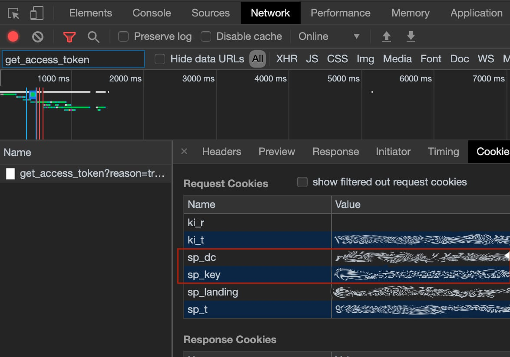

[](https://github.com/custom-components/hacs) [](https://github.com/fondberg/spotcast) 

[](https://www.buymeacoffee.com/fondberg)

# Spotcast
Home Assistant custom component to start Spotify playback on an idle chromecast device. As of version 2.8.0 it also supports playback on Spotify Connect devices (thanks to @kleinc80) which means that you can target your automation for chromecast as well as connect devices.

This component is not meant to be a full Spotify chromecast media_player but only serves to start the playback. Controlling the chromcast device and the Spotify playback after the initial start is done in their respective components.
Becasue starting playback using the API requires more powerful token the username and password used for browser login is used.

Used by https://github.com/custom-cards/spotify-card.

Community post: https://community.home-assistant.io/t/spotcast-custom-component-to-start-playback-on-an-idle-chromecast-device/114232

***Important***

Release 2.8.0 now supports Spotify connect devices (thanks to @kleinc80). And no, Sonos would still require extra integration, send one to me and I'll integrate it.

Release 2.9.0 transfer_playback removed! Now supports possibility to "Transfer Playback" even when there is nothing currently playing.

Release 3.0.0 New method for obtaining access token from Spotify. Please read [Configuration](#configuration) for new instruction.

## Installation

### This component is easiest installed using [HACS](https://github.com/custom-components/hacs)

### Manual
Copy all files from custom_components/spotcast/ to custom_components/spotcast/ inside your config Home Assistant directory.

### Configuration

#### Obtaining `sp_dc` and `sp_key` cookies
Spotcast uses two cookies to authenticate against Spotify in order to have access to the required services.

To obtain the cookies:
*  Using Chrome
>* Open url [`chrome://settings/cookies/detail?site=spotify.com`](chrome://settings/cookies/detail?site=spotify.com)
>* If no cookies appear go to [`https://open.spotify.com`](https://open.spotify.com) and sign-in
>* Copy content from `sp_dc` and `sp_key` cookies
* Using another browser
>* Use a browser extension like "Export cookies" and look for `sp_dc` and `sp_key` cookies

or
>* Open a new __Incognito window__ at https://accounts.spotify.com/en/login?continue=https:%2F%2Fopen.spotify.com%2F
>* Open Developer Tools in your browser (might require developer menu to be enabled in some browsers)
>* Login to Spotify.
>* Search/Filter for `get_access_token` in Developer tools under Network.
>* Under cookies for the request save the values for `sp_dc` and `sp_key`.
>* Close the window without logging out (Otherwise the cookies are made invalid).
>
>
* Alternatively you can use a browser plugin like "Export cookies".

#### Single account
Add the following to your config
```
spotcast:
  sp_dc: !secret sp_dc
  sp_key: !secret sp_key
```
#### Multiple accounts
Add `accounts` dict to the configuration and populate with a list of accounts to
be able to initiate playback using diffferent accounts than the default.
```

spotcast:
  sp_dc: !secret primary_sp_dc
  sp_key: !secret primary_sp_key
  accounts:
    niklas:
      sp_dc: !secret niklas_sp_dc
      sp_key: !secret niklas_sp_key
    ming:
      sp_dc: !secret ming_sp_dc
      sp_key: !secret ming_sp_key
```

## Call the service

#### start playback on a device with default account
```
{
	"device_name" : "Kök",
	"uri" : "spotify:playlist:37i9dQZF1DX3yvAYDslnv8",
	"random_song": true
}
```
where
 - `device_name` is the friendly name of the Chromecast
 - `uri` is the spotify uri, supports all uris including track (limit to one track)
 - `random_song` optional parameter that starts the playback at a random position in the playlist
 - `repeat` optional parameter that repeats the playlist/track
 - `shuffle` optional parameter to set shuffle mode for playback.
 - `offset` optional paramter to set offset mode for playback. 0 is the first song.

optionally you can specify the `entity_id` of an existing home assistant chromecast mediaplayer like:
```
{
	"entity_id" : "media_player.vardagsrum",
	"uri" : "spotify:playlist:37i9dQZF1DX3yvAYDslnv8"
}
```

### transfer current playback for the account
Omitting `uri` will transfer the playback to the specified device.
```
{
	"device_name" : "Högtalare uppe"
}
```
Use the parameter `force_playback` to continue the user's playback even if nothing is currently playing.
```
{
	"device_name" : "MultiRoom",
	"force_playback" : true
}
```
where
 - `device_name` is the friendly name of the Chromecast
 - `force_playback` (optional) true or false, true to continue the user's playback even if nothing is currently playing


#### start playback on a device with non default account
```
{
    "account":"niklas",
	"device_name" : "Kök",
	"uri" : "spotify:playlist:37i9dQZF1DX3yvAYDslnv8"
}
```
where
 - `account` is the name of account key in the accounts dictionary in the configuration
 - `device_name` is the friendly name of the Chromecast
 - `uri` is the spotify uri, supports all uris including track (limit to one track)

## Use the sensor
The sensor has the discovered chromecasts as both json and since v.2.1 as an array of objects.
Add the following to the sensor section of the configuration:
```
sensor:
    - platform: spotcast
```

Sensor name
```
sensor.chromecast_devices
```
Attributes
```
devices_json: [{"name": "Kök", "cast_type": "audio", "model_name": "Google Home", "uuid": "xxxxx", "manufacturer": "Google Inc."}, {"name": "Högtalare uppe", "cast_type": "group", "model_name": "Google Cast Group", "uuid": "xxxx", "manufacturer": "Google Inc."}, {"name": "Vardagsrum", "cast_type": "cast", "model_name": "HK Citation 300", "uuid": "xxxx", "manufacturer": "Harman Kardon"}]

last_update: 2019-05-01T15:27:49.828553+02:00

friendly_name: Chromecast Devices
```


 ## Known issues
 It has been reported that updating the sensor takes more than 10s sometimes.

 ## Donate
 If you like what I do and want to support me then I love coffee

<a href="https://www.buymeacoffee.com/fondberg" target="_blank"></a>

 ## Contribute
 Please do

 ## License
 Apache 2.0
